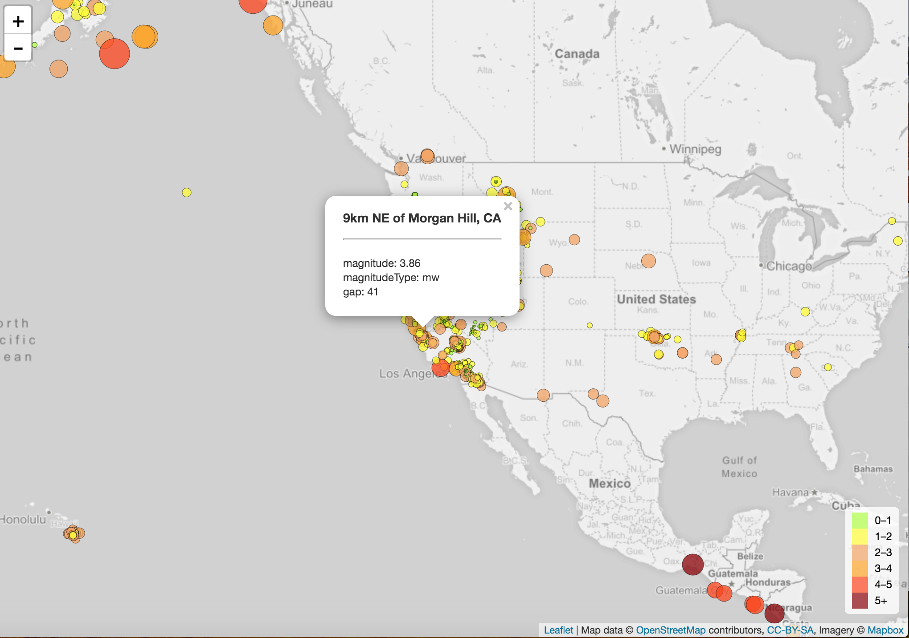

# Visualizing Data with Leaflet

## Challenge desription

The USGS (the United States Geological Survey) is interested in building a new set of tools that will allow them visualize their earthquake data. They collect a massive amount of data from all over the world each day, but they lack a meaningful way of displaying it. Their hope is that being able to visualize their data will allow them to better educate the public and other government organizations (and hopefully secure more funding..) on issues facing our planet.

### Visualization
I visualized an earthquake data set.

1. **How to get data set**

   

   The USGS provides earthquake data in a number of different formats, updated every 5 minutes. I picked a JSON data set from [USGS GeoJSON Feed](http://earthquake.usgs.gov/earthquakes/feed/v1.0/geojson.php) page to visualize.

   

2. **Import & Visualize the Data**

   I created a map using Leaflet that plots all of the earthquakes from this data set based on their longitude and latitude. 
   *  Data markers reflect the magnitude of the earthquake in their size and color. Earthquakes with higher magnitudes appear larger and darker in color.

   * Visualization includes popups that provide additional information about the earthquake when a marker is clicked.

   * I created a legend that will provide context for this map data.
